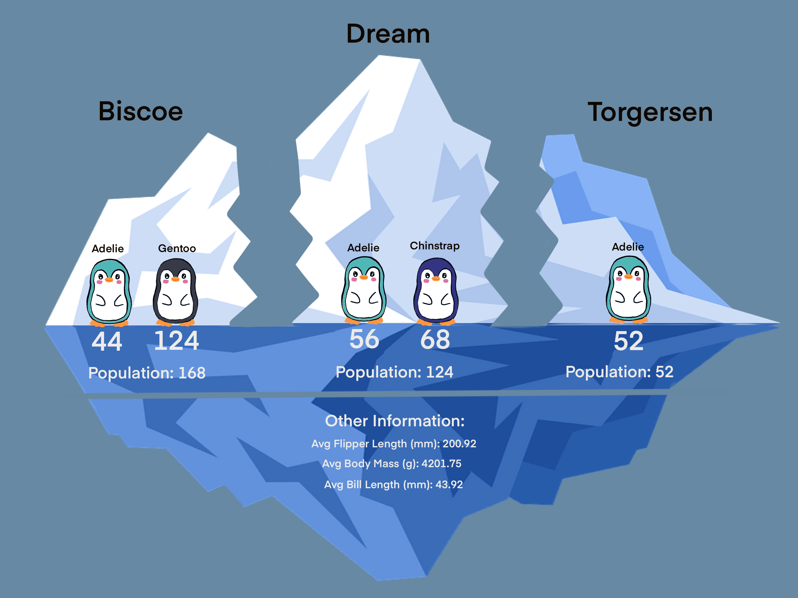
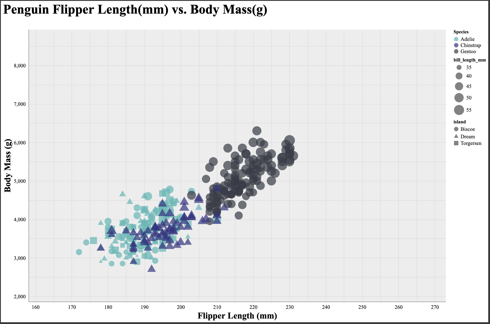
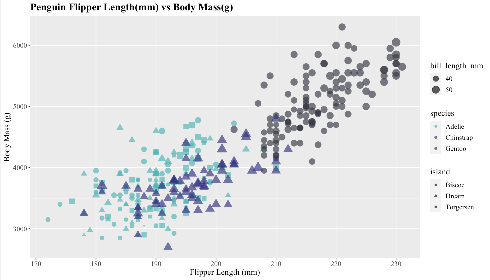

# General Visualization of Data and Statistics
Design Achievements:
I made this visualization to tell a story and show some of the data and statistics.
The idea is that the penguins got separated on different islands because of an iceberg which drifted apart. (Note the bottom of the iceberg is still intact, but the top isn't). This caused them to develop populations on those islands of Biscoe, Dream, and Torgersen. Some of the islands had two species while others only had one. One interesting fact is that the Adelie Penguins appear on all the islands. Maybe they are better swimmers?

# Altair
Altair is a python library that focuses on providing interactive and immersive data visualization experiences.
I used Google Colaboratory for Altair, coding and displaying the plots.
In addition to Altair, I also used the pandas library.
To visualize the data set, I first had to set the dimensions for the plot and then I used chart = () to create the scatterplot, which has built in functions for color, size, and shape. Then chart at the end to display the plot.
Overall, Altair is a great library for data visualization, and the customizability is great.

Technical Achievements:
- Added functionality where users are able to interact with the graph, They can zoom in and out of the graph, as well as pan around. 
- Added functionality where users are able to select a species of Penguin by clicking on that particular species on the graph, which will cause all the other species to disappear.
- Added functionality where users are able to hover over a point and it will give details for that specific penguin.
- Added another element of shapes, which is determined by the island the penguin is from.
- Added the Legend on the top right side.

Design Achievements: 
- Colors for the points on the scatterplot was thoroughly discussed with my girlfriend who specializes in illustration and graphic design. We want the color palette that relates to the penguin theme, while also making them distinct enough for the audience to easily identify the different species within the plot.
- I want the scatterplot to be read easily which is why I went with the Times New Roman font. Bolding the titles and axis will help the reader easily identify what they are looking at. Also, the sizes of the axis titles are a little larger than the axis labels for better readability.
- A legend was added to help the reader understand the plot.
- The species selection functionality allows the user to focus in on one particular species when trying to analyze the graph. 

# d3
Link:

d3 is a javascript library that focuses on the creation of dynamic and interactive data visualizations in web browsers.
d3 has a lot of built in frameworks and documentations that can help you get started. 
I used the Template: https://d3-graph-gallery.com/graph/custom_theme.html#ggplot2, which is inspired by the ggplot2 from R Studio.
To visualize the data set, I appended a svg, a rectangle, texts, circles, etc to create the scatterplot.
Implementation of shapes is possible, but a lot harder than the other softwares/libraries that I used for this assignment.
Overall, I think d3 has the most customizability out of all the softwares/libraries, but it's also the most time consuming. 

Technical Achievements:
- Added functionality where users are able to select a species of Penguin by hovering over that particular species on the graph, which will cause all the other species to decrease in opacity. In addition, the species you are currently hovering over will increase in opacity.
- Added functionality where users are able to hover over a point and it will give details for that specific penguin, mainly their species, flipper length, and body mass.
- Added the Legend on the top right side.

Design Achievements: 
- Again, colors for the points on the scatterplot was thoroughly discussed with my girlfriend who specializes in illustration and graphic design. We want the color palette that relates to the penguin theme, while also making them distinct enough for the audience to easily identify the different species within the plot.
- I opted for the Times New Roman font for better readability. In addition, bolding the titles and axis will help the reader easily identify what they are looking at. Also, the sizes of the axis titles and legend titles are a little larger than the axis labels for better readability.
- A legend was added to help the reader understand the plot.
- The species selection functionality allows the user to focus in on one particular species when trying to analyze the graph, while the other species are less apparent in the background.

# MATLAB
MATLAB is a programming  language and numerical computing environment widely used in engineering, science, etc.
MATLAB comes equipped with a vast array of built-in functions and toolboxes for various applications.
I tested the gscatter addon, while it was easy to use and helps when you have a group scatterplot (Ex. different colors for species). It limited my to customize the plots, which is why I opted not to use it.
In addition, MATLAB, offers a lot of built in functionality like panning, zooming, and labels.
To visualize the data set, I used three separate scatter functions, one for each species. 
Overall, I think MATLAB is a great tool for getting a quick and basic graph, as it already has a lot of built-in functionalities to the graphs. The marketplace and addons also allows for more customizability and makes some areas easier to use.

Technical Achievements:
- Added the Legend on the top right side.

Design Achievements: 
- Again, colors for the points on the scatterplot was thoroughly discussed with my girlfriend who specializes in illustration and graphic design. We want the color palette that relates to the penguin theme, while also making them distinct enough for the audience to easily identify the different species within the plot.
- A legend was added to help the reader understand the plot.

# R-ggplot2
The R programming language is a powerful and widely-used statistical computing and graphics language.
The IDE includes built-in tools for creating and exploring visualizations of data. Users can generate a wide range of plots and charts to better understand and communicate their data.
ggplot2 is a popular library for graphing in R.
To visualize the data set, I used ggplot2's geom_point(), which has different aesthetics functions for things like color, size, and shape.
Overall, I think R (ggplot2) is a great tool for data visualization, as it offers a lot of customizability, and also animations as well.

Technical Achievements:
- Added another element of shapes, which is determined by the island the penguin is from.
- Added the Legend on the top right side.

Design Achievements: 
- Again, colors for the points on the scatterplot was thoroughly discussed with my girlfriend who specializes in illustration and graphic design. We want the color palette that relates to the penguin theme, while also making them distinct enough for the audience to easily identify the different species within the plot.
- I opted for the Times New Roman font for better readability. In addition, bolding the title will help the reader easily identify what they are looking at. Also, the sizes of the axis titles and legend titles are a little larger than the axis labels for better readability.
- A legend was added to help the reader understand the plot.

# Tableau
Tableau is powerful data visualization and business software that allows users to transform raw data into visually appealing and interactive dashboards.
It makes data analysis accessible to individuals without extensive technical backgrounds in programming.
Tableau provides a drag-and-drop interface that allows users to create visualizations effortlessly. In addition they make it easy to explore data, select variables, and build charts and graphs without the need for complex coding.
To visualize the data I dragged Flipper Length to columns and Body Mass G to rows. Under marks I have colors for Species, shapes for Islands,
and size for Bill Length. (Make sure in the dropdown of each element, all of them is set to dimension, as it defaults to sum) It then generates the scatterplot for you.
Overall, I think Tableau is a wonderful tool for generating data visualization especially if you want to generate a quick graph or if you are inexperienced in coding. The tool offers a lot of functionality and aesthetic options to fit your needs.

Technical Achievements:
- Added another element of shapes, which is determined by the island the penguin is from.
- Added the Legend on the top right side.

Design Achievements: 
- I was unable to figure out how to use hex codes, so I tried matching it to the rest of my graphs with the colors they have. Again, I wanted a color palette that relates to the penguin theme, while also making them distinct enough for the audience to easily identify the different species within the plot.
- A legend was added to help the reader understand the plot.

